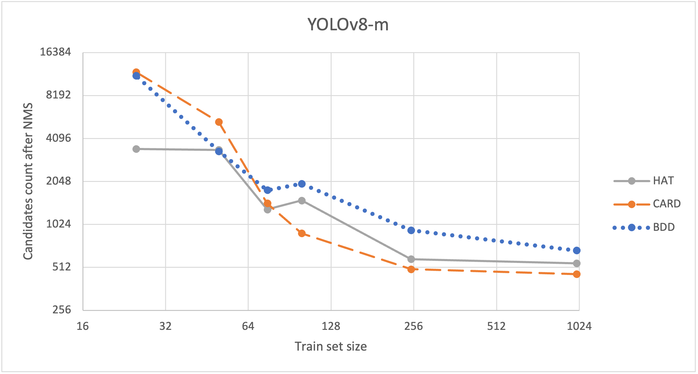

# DAMO-YOLO and YOLOv8 performance comparison depending on train dataset size
This repo contains the code base for my MS graduation work.
It compares performance of 3 object detection models (DAMO-YOLO-Ns, DAMO-YOLO-Nm and YOLOv8-m) [[1]](#1)[[2]](#2) 
based on the size of the dataset used for models train.

Experiment setup:
1. Experiment was successfully conducted on 2 datasets: Hard Hat Workers Dataset (HAT) [[3]](#3) 
and BDD100K (BDD) [[4]](#4).
2. Datasets were pre-processed to decrease task complexity and dataset peculiarities impact on the results
as much as possible
3. Models were trained until loss and metrics reached a plateau
4. Test set was always fixed
5. All results were calculated after NMS (confidence_threshold=0.01, iou_threshold=0.7) on models' output.

Performance metrics:

DAMO-YOLO models usually generate >100,000 candidates.
Number of candidates produced by YOLOv8-m is:

Analysis:
1. DAMO-YOLO-Ns is a good choice for small train sets because it has
   performance metrics comparable to YOLOv8-m, but requires less resources for train, store and evaluation.
2. YOLOv8-m is a good choice for large datasets or if small number of generated candidates is required.
3. For small train set size the main problem is incorrect `confidence` score.
4. For large train set size all models improve their `confidence` scores,
   but YOLOv8-m does it better.
5. Number of candidates generated by YOLOv8-m is significantly lower 
to the number of candidates produced by DAMO-YOLO, 
and this number decreases with train set size increases.
6. All models have similar localization capability for all train set sizes.
    This capability increases and stabilizes with train set size growth.

Trained weights could be found <a href='https://drive.google.com/file/d/1uiXQRvtUx_bLeS5oLyHaG6FA82E5RUuD/view?usp=sharing'>here</a>, 
full text of research could be found <a href='https://drive.google.com/file/d/1kgWetNBR6Jpmgtvk6T27keDmlbZ1-vLw/view?usp=sharing'>here</a> (Ukrainian).

Code structure:
1. 1_Analyze_datasets - calculate statistics for each bbox in dataset. 
Roughly estimate hyperparameters for data selection (classes and target area)
2. 2_Select_valid_data
   1. Generate bbox for crop
   2. Select valid classes
   3. Sample items
   4. Split items to the train/val/test sets
   5. Generate datasets in Yolov8/COCO formats
3. 3_Parse_damo_yolo_logs - plot statistics from DAMO-YOLO logs
4. 4_Calculate_metrics - run YOLOv8 on validation sets 
and calculate metrics using pycocotools lib (used in DAMO-YOLO lib for metrics calculation)
5. 5_DAMO-YOLO - train DAMO-YOLO-ns/nm models
6. 6_Yolo - train YOLOv8

References:

<a id="1">[1]</a> https://github.com/tinyvision/DAMO-YOLO

<a id="2">[2]</a>  https://github.com/ultralytics/ultralytics

<a id="3">[3]</a>  https://public.roboflow.com/object-detection/hard-hat-workers

<a id="4">[4]</a>  https://doc.bdd100k.com/download.html
