# DAMO-YOLO and YOLOv8 performance comparison depending on train dataset size
This repo contains the code base for my MS graduation work.
It compares performance of 3 object detection models (DAMO-YOLO-Ns, DAMO-YOLO-Nm and YOLOv8-m) [[1]](#1)[[2]](#2) 
based on the size of the dataset used for models train.

Experiment setup:
1. Experiment was successfully conducted on 2 datasets: Hard Hat Workers Dataset (HAT) [[3]](#3) 
and BDD100K (BDD) [[4]](#4).
2. Datasets were pre-processed to decrease task complexity and dataset peculiarities impact on the results
as much as possible
3. Models were trained until loss and metrics reached a plateau
4. Test set was always fixed
5. All results were calculated after NMS (confidence_threshold=0.01, iou_threshold=0.7) on models' output.

Performance metrics:
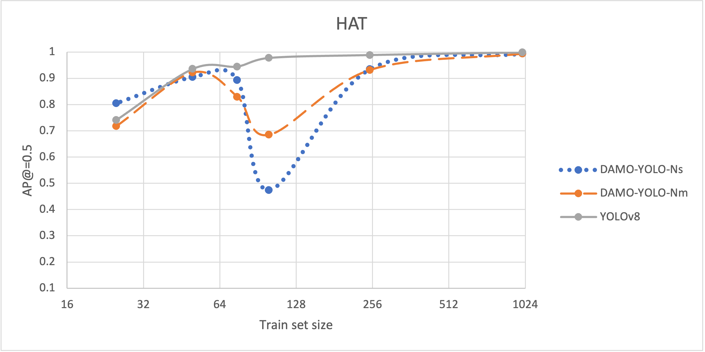
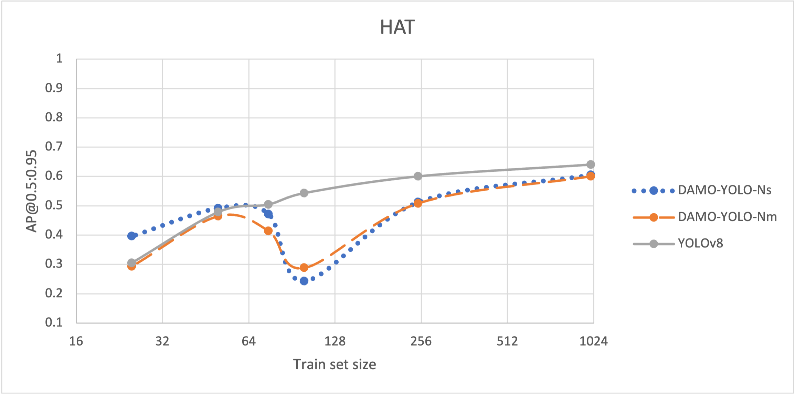
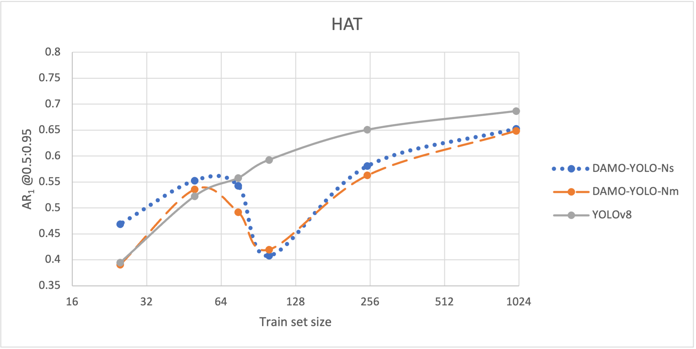
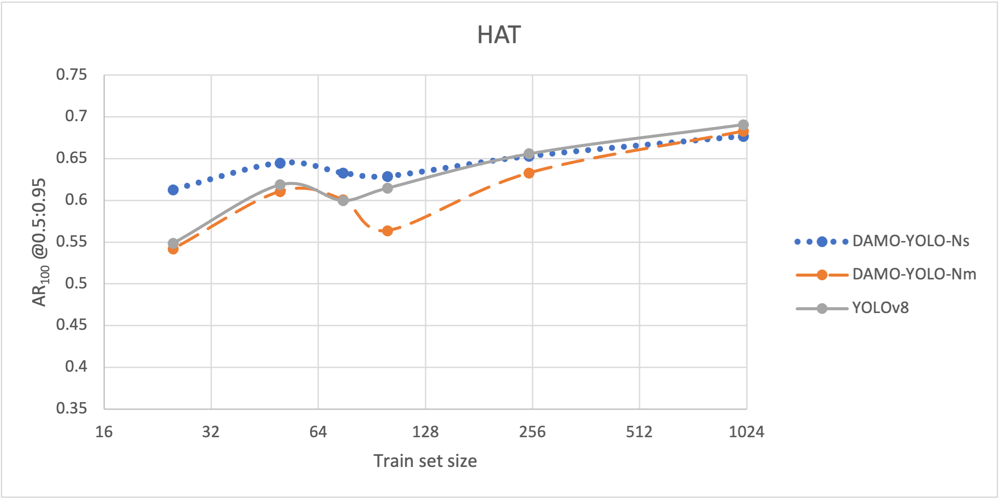
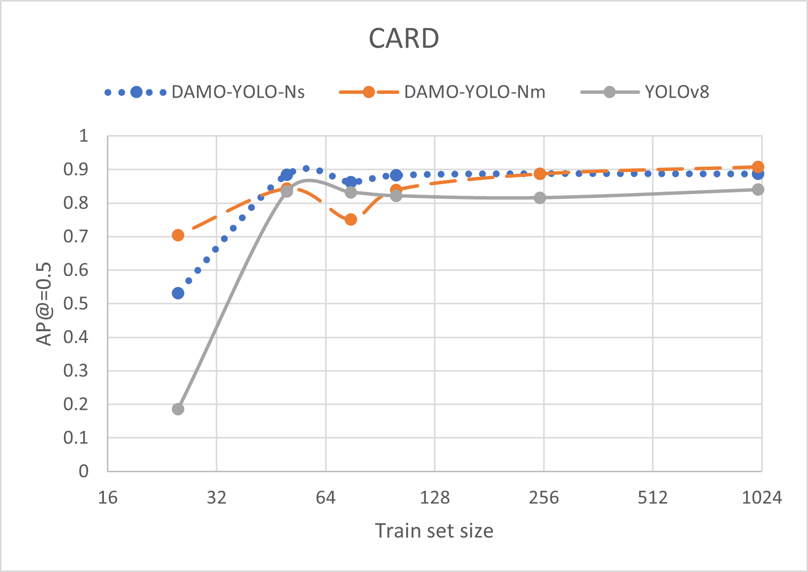
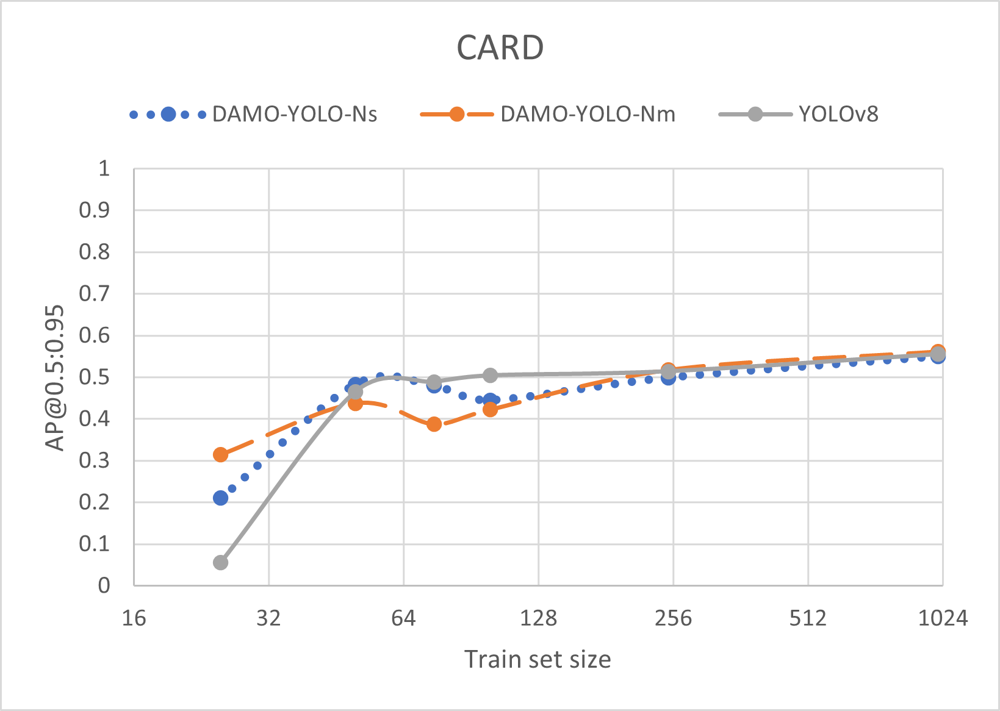
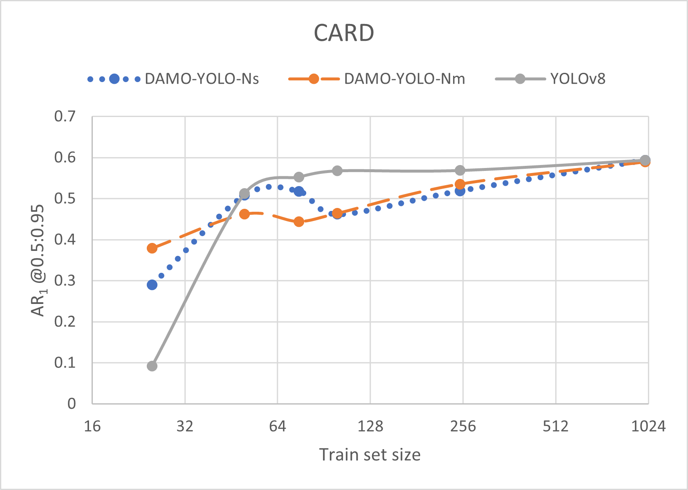
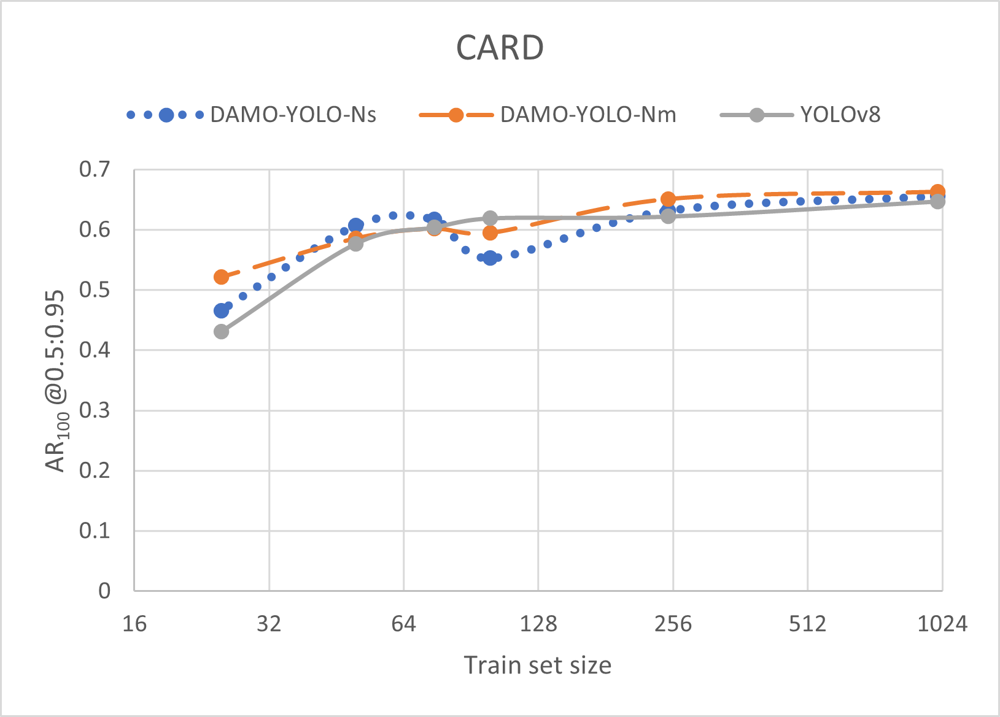
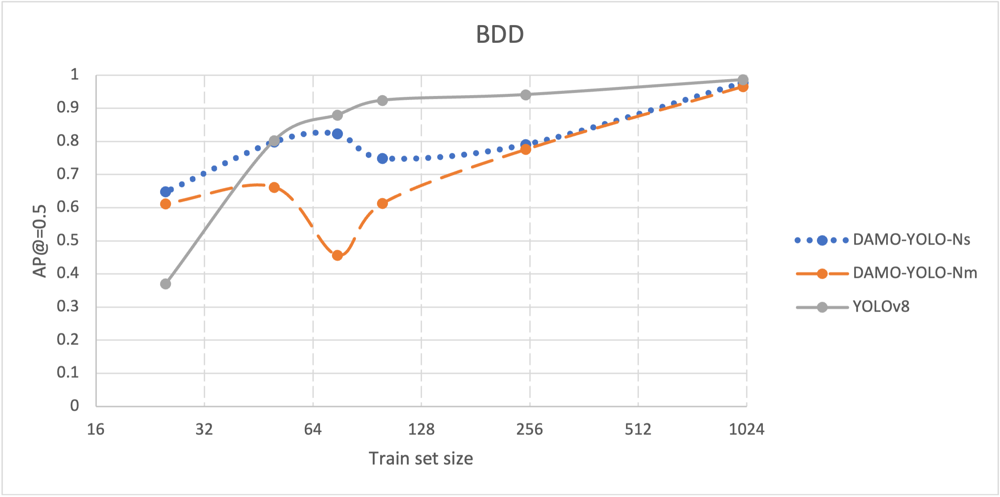
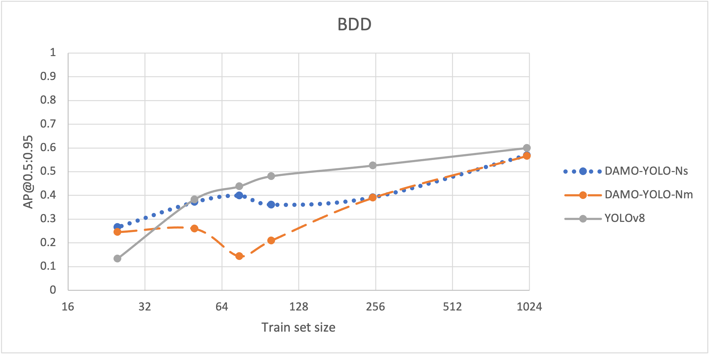
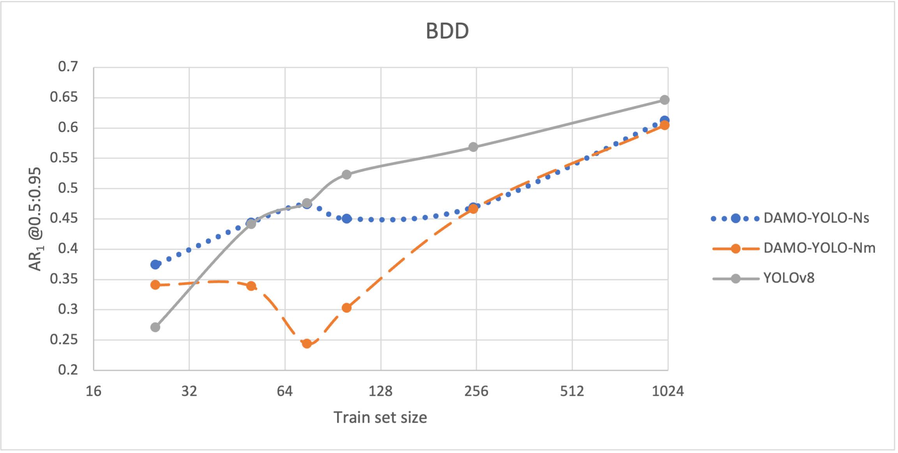
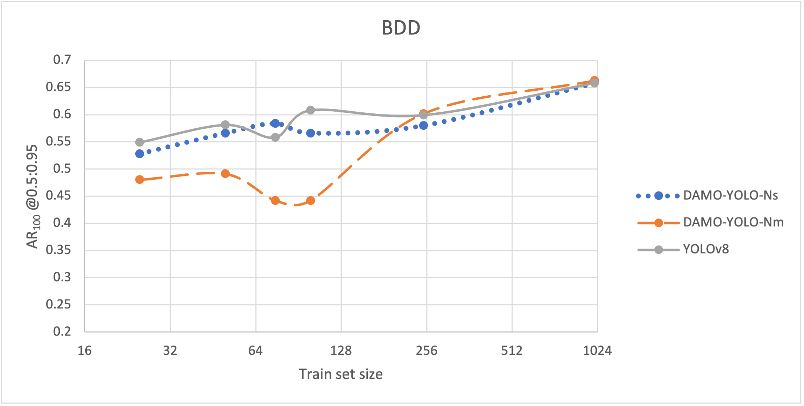

Analysis:
1. For large datasets, larger models are expected to achieve better detection accuracy.
2. For small datasets, smaller models tend to demonstrate better detection accuracy.
3. Although models with a large number of parameters show poorer results on small datasets, 
these results are not always significantly lower. Such models can still be acceptable for use 
on lightweight datasets in certain tasks.
4. Models with a small number of parameters tend to have lower metrics on large samples. 
However, the results are not always significantly worse. 
Considering the low resource requirements of these models for training and evaluation, 
they may be a suitable choice for large datasets in some circumstances.
5. When training with a small dataset, the main problem of all models is the poor quality of candidates ranking 
by the confidence parameter. Therefore, for such cases, developing a logic to account for low-confidence predictions 
can have a greater positive impact on results compared to cases with large amounts of data.

In the conducted experiments, the approach for data selection and preparation approach was designed 
to simplify the task of object detection as much as possible. Therefore, results may differ significantly 
on more complex datasets.

Paper based on research could be found <a href='https://drive.google.com/file/d/1g2iH_nLnyy3_m2XY_M_P_c3TgAz-ePv1/view?usp=sharing'>here</a> (English).
Trained weights could be found <a href='https://drive.google.com/file/d/1cGe7GfJ5Hwnv7__ET6LcDBQZI7_aNydY/view?usp=sharing'>here</a>, 
full text of research could be found <a href='https://drive.google.com/file/d/1kgWetNBR6Jpmgtvk6T27keDmlbZ1-vLw/view?usp=sharing'>here</a> (Ukrainian).

Code structure:
1. 1_Analyze_datasets - calculate statistics for each bbox in dataset. 
Roughly estimate hyperparameters for data selection (classes and target area)
2. 2_Select_valid_data
   1. Generate bbox for crop
   2. Select valid classes
   3. Sample items
   4. Split items to the train/val/test sets
   5. Generate datasets in Yolov8/COCO formats
3. 3_Parse_damo_yolo_logs - plot statistics from DAMO-YOLO logs
4. 4_Calculate_metrics - run YOLOv8 on validation sets 
and calculate metrics using pycocotools lib (used in DAMO-YOLO lib for metrics calculation)
5. 5_DAMO-YOLO - train DAMO-YOLO-ns/nm models
6. 6_Yolo - train YOLOv8

References:

<a id="1">[1]</a> https://github.com/tinyvision/DAMO-YOLO

<a id="2">[2]</a>  https://github.com/ultralytics/ultralytics

<a id="3">[3]</a>  https://public.roboflow.com/object-detection/hard-hat-workers

<a id="4">[4]</a>  https://doc.bdd100k.com/download.html
